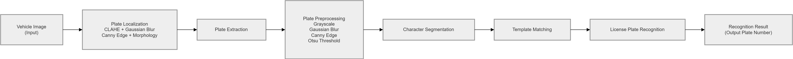
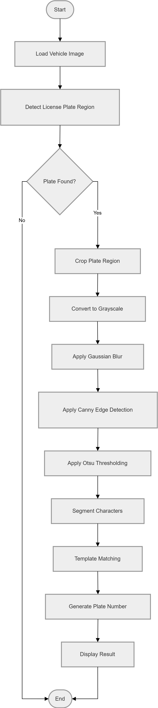

# DetecPlat: Vehicle License Plate Detection and Recognition System

## 1. Project Overview

DetecPlat is a desktop-based application developed using Python, OpenCV, and PyQt5 for automatic vehicle license plate detection and recognition. The system utilizes computer vision techniques and template matching algorithms to identify license plate characters from vehicle images.

The application provides a complete recognition pipeline, starting from plate localization, image preprocessing, character segmentation, and ending with license plate recognition and performance evaluation.

---

## 2. Project Objectives

The main objectives of this project are:

* Detect vehicle license plates automatically from vehicle images.
* Extract the license plate region accurately.
* Segment individual characters from the detected plate.
* Recognize alphanumeric characters using template matching techniques.
* Evaluate system performance using a prepared dataset.

---

## 3. System Architecture

### Block Diagram

### System Flowchart

---

## 4. Dataset Description

### Vehicle Dataset

The vehicle dataset consists of 29 vehicle images containing various license plate formats and image conditions. The ground truth information is stored in the filename of each image.

| Parameter        | Description                             |
| ---------------- | --------------------------------------- |
| Number of Images | 29                                      |
| File Format      | JPG                                     |
| Ground Truth     | License plate number stored in filename |

### Template Dataset

The template dataset contains character templates used for recognition through template matching.

| Parameter           | Description                        |
| ------------------- | ---------------------------------- |
| Total Templates     | 116                                |
| Character Types     | A–Z and 0–9                        |
| Template Variations | Multiple styles for each character |
| Image Format        | JPG                                |

---

## 5. Methodology

The recognition process is performed through the following stages:

### 5.1 Image Acquisition

Vehicle images are loaded into the system as the primary input for processing.

### 5.2 License Plate Localization

The license plate region is detected using:

* CLAHE (Contrast Limited Adaptive Histogram Equalization)
* Gaussian Blur
* Canny Edge Detection
* Morphological Operations
* Contour Detection

### 5.3 Plate Preprocessing

The extracted plate image is enhanced through:

* Grayscale Conversion
* Gaussian Blur
* Canny Edge Detection
* Otsu Thresholding

### 5.4 Character Segmentation

Individual characters are isolated from the plate image using contour analysis and filtering techniques.

### 5.5 Character Recognition

Each segmented character is compared against the template dataset using Template Matching based on Normalized Cross Correlation.

### 5.6 Result Generation

Recognized characters are combined to generate the final license plate number.

---

## 6. Technologies Used

The project was developed using the following technologies:

| Technology   | Purpose                                   |
| ------------ | ----------------------------------------- |
| Python       | Main programming language                 |
| OpenCV       | Image processing and computer vision      |
| NumPy        | Numerical computation                     |
| PyQt5        | Graphical User Interface (GUI)            |
| Git & GitHub | Version control and project documentation |

---

## 7. System Features

The implemented system provides several key features:

* Automatic license plate detection.
* Multi-stage image preprocessing.
* Character segmentation.
* Template matching-based recognition.
* Visual processing pipeline display.
* Dataset accuracy evaluation.
* User-friendly graphical interface.

---

## 8. Expected Results

The system is expected to:

* Detect vehicle license plates automatically.
* Recognize alphanumeric characters accurately.
* Provide visualization of each image processing stage.
* Evaluate recognition performance on the available dataset.

---

## 9. Conclusion

DetecPlat successfully demonstrates the implementation of computer vision techniques for automatic vehicle license plate recognition. By combining image preprocessing, character segmentation, and template matching, the system provides an effective solution for recognizing vehicle license plates and evaluating recognition performance using a prepared dataset.

---

## 10. Repository Information

**GitHub Repository:**
https://github.com/ratuqra/DetecPlat

**Documentation Website:**
https://ratuqra.github.io/DetecPlat/
